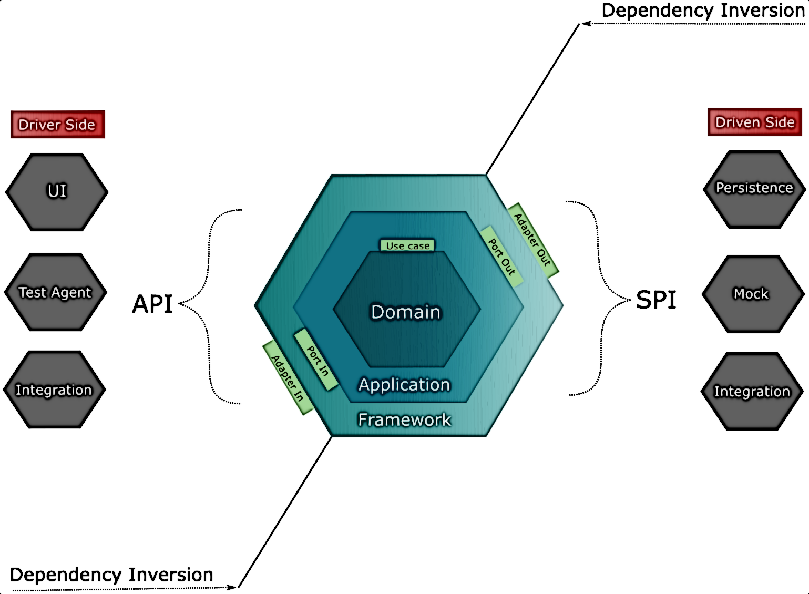

# Architecture

The current architecture is established following an hexagonal architecture approach.

The layers established are domain, application and adapter (most of the literature 
refers this last layer as "infrastructure" or "framework").

An overview of each layer can be found in these docs:
- [Domain](./domain/introduction.md)
- [Application](./application/introduction.md)
- [Adapter](./adapter/introduction.md)
